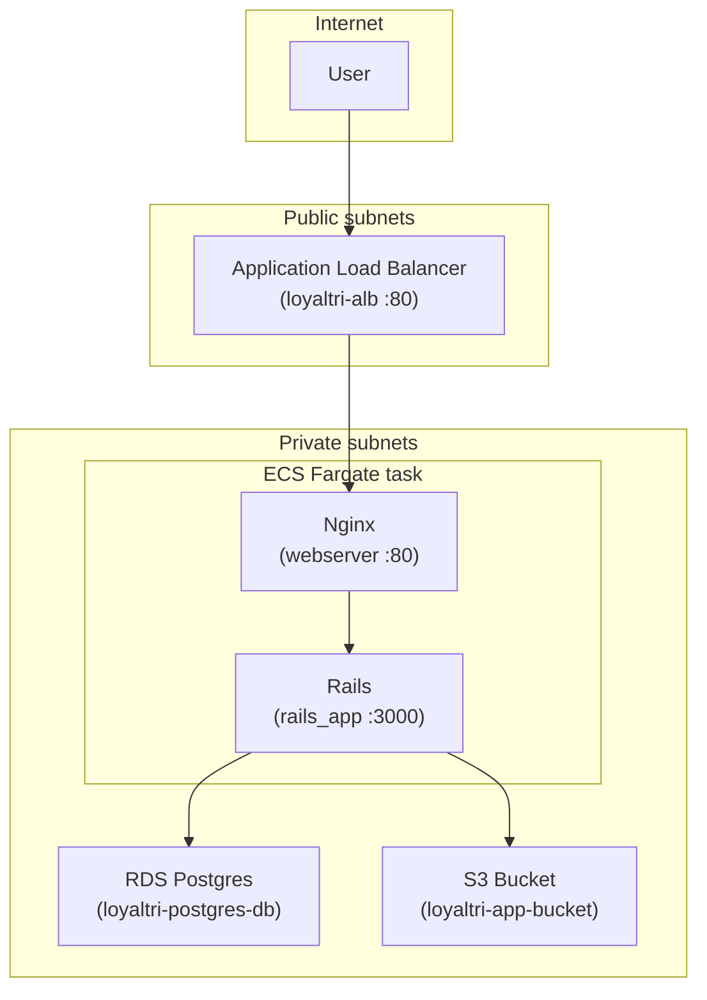

# Architecture and deployment steps

## Architecture diagram

```
                                    Internet
                                        │
                                        ▼
┌─────────────────────────────────────────────────────────────────────────────┐
│  Public subnets (10.0.1.0/24, 10.0.2.0/24)                                   │
│  ┌───────────────────────────────────────────────────────────────────────┐  │
│  │  Application Load Balancer (loyaltri-alb)                              │  │
│  │  • Listens on port 80                                                  │  │
│  │  • Forwards to ECS tasks in private subnets                            │  │
│  └───────────────────────────────────────────────────────────────────────┘  │
└─────────────────────────────────────────────────────────────────────────────┘
                                        │
                                        │ Target group (port 80)
                                        ▼
┌─────────────────────────────────────────────────────────────────────────────┐
│  Private subnets (10.0.3.0/24, 10.0.4.0/24)                                  │
│  ┌─────────────────────────────────────────────────────────────────────┐   │
│  │  ECS Fargate service (loyaltri-service)                                │   │
│  │  ┌─────────────────┐  ┌─────────────────┐                             │   │
│  │  │  Nginx ( :80 )  │──│  Rails ( :3000 )│                             │   │
│  │  │  webserver img  │  │  rails_app img  │                             │   │
│  │  └─────────────────┘  └────────┬────────┘                             │   │
│  └────────────────────────────────┼────────────────────────────────────┘   │
│                                    │                                         │
│  ┌────────────────────────────────┼────────────────────────────────────┐   │
│  │  RDS Postgres (private)         │  S3 (IAM role)                       │   │
│  │  loyaltri-postgres-db           │  loyaltri-app-bucket                 │   │
│  └────────────────────────────────┴────────────────────────────────────┘   │
└─────────────────────────────────────────────────────────────────────────────┘
```

### Mermaid diagram (for GitHub / docs)



---

## Deployment steps (order of operations)

1. **Fork the repo** and clone it locally.

2. **Build and push Docker images to ECR**  
   - Create ECR repos: `rails_app`, `webserver`.  
   - Build from repo root with `docker build -f docker/app/Dockerfile .` and `docker build -f docker/nginx/Dockerfile .`.  
   - Tag and push to your ECR (see [infrastructure/README.md](README.md#1-build-and-push-docker-images-to-ecr)).

3. **Update ECR image URLs in Terraform** (if not using default account/region)  
   - In `infrastructure/ecs_task.tf`, set the `image` for `rails_app` and `nginx` to your ECR URIs (e.g. `<account>.dkr.ecr.ap-south-1.amazonaws.com/rails_app:latest`).

4. **Apply Terraform**  
   - `cd infrastructure`  
   - `terraform init`  
   - `terraform plan`  
   - `terraform apply`

5. **Verify**  
   - In AWS Console: ECS cluster `loyaltri-ecs-cluster`, service `loyaltri-service` running.  
   - Target group `loyaltri-tg` shows healthy targets (may take a few minutes after first deploy).  
   - Open `http://<alb-dns-name>` in a browser.

6. **Optional: scale**  
   - Change `desired_count` in `ecs_service.tf` and run `terraform apply`, or scale in the ECS console.

---

## Resource summary

| Resource | Name / identifier | Purpose |
|----------|-------------------|--------|
| VPC | loyaltri-vpc | 10.0.0.0/16 |
| Public subnets | public-subnet-1/2 | ALB only |
| Private subnets | private-subnet-1/2 | ECS, RDS |
| ALB | loyaltri-alb | HTTP :80, forwards to ECS |
| Target group | loyaltri-tg | Port 80, health check / |
| ECS cluster | loyaltri-ecs-cluster | Fargate |
| ECS service | loyaltri-service | Runs rails_app + nginx task |
| RDS | loyaltri-postgres-db | Postgres 14, private |
| S3 | loyaltri-app-bucket | App storage (IAM role) |
| CloudWatch Logs | /ecs/loyaltri-app | Rails and Nginx logs |
